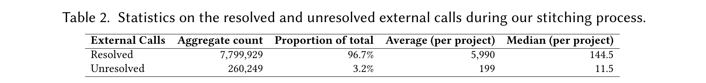

# Automated Table Reproduction via Code Generation

This repository contains the artifact for the paper **"Automated Table Reproduction via Code Generation"** (ASE 2026).

The artifact supports two kinds of reproduction:

1. **Last-mile reproduction**: regenerate the paper abstract, tables, figures, and compact `ase.pdf` wrapper from archived experimental logs.
2. **Full reproduction**: rerun the complete agent experiments from scratch, then run the last-mile reproduction pipeline on the new logs.

For artifact evaluation, we recommend starting with **Last-mile reproduction**. It is fast, does not require LLM API credits, and directly validates the data used for the paper's generated tables and figures.

## Last-mile reproduction

Last-mile reproduction regenerates the submitted artifact outputs from archived logs. This is the recommended artifact-evaluation path.

### Docker image requirements

For the version used by this artifact, expect a **2.3 GB compressed download** and approximately **6.9 GB unpacked in Docker's image store**.
Reserve at least **10 GB of free space in the Docker data/root filesystem** for the pull, unpacking, and container writable layer.

### Docker setup

Run the last-mile reproduction with:

```bash
docker run --platform linux/amd64 --rm -it -v "$PWD":/output ghcr.io/doehyunbaek/artisan:latest
```

This writes `./ase-artisan.pdf` on the host.
The command emits detailed download, generation, and LaTeX logs; a successful run ends with output similar to:

```text
== Done ==
Wrote /artifact/data/tex/ase-artisan.pdf
Wrote /artifact/ase-artisan.pdf
Wrote /output/ase-artisan.pdf
```

After the container exits, `./ase-artisan.pdf` should be created at the host directory.
The image is based on Ubuntu 24.04 LTS and built from [`Dockerfile`](./Dockerfile).
For other platforms, use the Docker image or open an issue.

The command above runs [`data/reproduce.py`](./data/reproduce.py), which performs the following steps.

To run the steps manually or inspect the container, start an interactive shell instead:

```bash
docker run --platform linux/amd64 --rm -it -v "$PWD":/output ghcr.io/doehyunbaek/artisan:latest bash
```

The manual commands below assume you are inside this container shell.
The repository is mounted at `/artifact`, and host outputs should be written under `/output`.

### Step 1: Restore logs

```bash
cd /artifact/data
python3 download_logs.py
```

This restores archived run logs under:

```text
/artifact/data/logs/
```

Expected layout:

```text
logs/
  artisan-gpt5.1-dbe0/
  artisan-gpt5mini-845b/
  artisan-deepseek-reasoner-6f4b/
  ...
```

### Step 2: Regenerate the abstract

```bash
cd /artifact/data
python3 abstract.py
```

Expected output:

```text
tex/abstract.tex
```

### Step 3: Regenerate tables

```bash
cd /artifact/data
python3 table.py
```

Expected outputs:

```text
tex/table_1.tex
tex/table_2.tex
tex/table_3.tex
tex/table_4.tex
```

Table provenance:

| Table | Source |
| --- | --- |
| Table 1 | Static comparison table |
| Table 2 | Restored logs plus manual corrections |
| Table 3 | `data/method_judge_eval.jsonl` |
| Table 4 | `data/bugs/bugs.json` |

### Step 4: Regenerate figures

Figure 8 uses Matplotlib/NumPy, which are included in the prebuilt image.

```bash
cd /artifact/data
python3 figure.py
```

Expected outputs:

```text
tex/figure_1.tex
tex/figure_2.tex
...
tex/figure_9.tex
tex/figures/overview.pdf
tex/figures/artisan_time_breakdown.png
```

Figure provenance:

| Figure | Source |
| --- | --- |
| Figures 1--7, 9 | Static snippets/assets from the paper |
| Figure 8 | Regenerated from restored logs |

### Step 5: Build the compact ASE wrapper PDF

```bash
cd /artifact/data/tex
pdflatex -shell-escape ase.tex
bibtex ase
pdflatex -shell-escape ase.tex
pdflatex -shell-escape ase.tex
```

Expected outputs:

```text
tex/ase.pdf
tex/ase-artisan.pdf
/artifact/ase-artisan.pdf
```

The `-shell-escape` flag is required because the generated figure fragments use `minted` for syntax highlighting.

### Notes on expected differences

The artifact regenerates values from the archived logs instead of relying on hardcoded values in the submitted manuscript. We identified two expected differences.

#### Table 2 token values

The submitted manuscript hardcoded token averages in `artisan-paper/tables/baseline.tex`. The artifact recomputes token averages directly from restored logs. Counts, costs, and times match; differences are limited to five token cells:

| Row | Artifact-generated value | Submitted-manuscript value |
| --- | ---: | ---: |
| SWE-agent / GPT-5-mini | 363.9k | 363.6k |
| SWE-agent / GPT-5.1 | 513.0k | 512.8k |
| OpenHands / DeepSeek | 796.4k | 789.8k |
| OpenHands / GPT-5-mini | 473.3k | 468.4k |
| OpenHands / GPT-5.1 | 577.1k | 569.8k |

We will update the camera-ready version with the Table 2 generated by this artifact.

#### Figure 8 export/layout

Figure 8 is regenerated from restored logs.
The regenerated plot uses the same data and structure as the submitted figure, but exact PNG equality is sensitive to Matplotlib version, fonts, and bounding-box export behavior.
Any remaining Figure 8 difference should be an image export/layout difference, not a data difference.

We will update the camera-ready version with the Figure 8 generated by this artifact.

## Full reproduction

Full reproduction reruns the complete experimental campaign instead of using archived logs. It is substantially more expensive than last-mile reproduction and is not required for routine artifact evaluation.

### Cost estimate

The paper evaluates 15 configurations over 60 Artisan-Bench tasks, i.e., 900 agent runs in total.
The experimental setup uses a 30-step limit, a USD 1 agent-cost limit, and an eight-hour wall-clock limit per task.

Based on the average per-task values reported in Table 2 of the paper:

- Expected LLM cost for the complete 900-run campaign is about **USD 172**.
  - Main comparison runs: about **USD 102**.
  - Ablation runs: about **USD 70**.
- NOTE: The configured upper bound is much larger: 900 runs × USD 1/run = **USD 900** for the agent-side budget alone.

### Requirements

Full reproduction requires:

- Docker access from inside the artifact container via `/var/run/docker.sock`
- Network access to download research artifacts and Docker images
- LLM API keys and enough budget for 15 configurations over 60 tasks
- `OPENAI_API_KEY` for GPT configurations and the format/method judges
- `DEEPSEEK_API_KEY` or `LLM_API_KEY` for DeepSeek configurations

### Smoke-test bloat Table 2

We illustrate the full reproduction process with a single run due to cost reasons.
We reproduce the following table:



Source: Table 2 from “Bloat beneath Python’s Scales: A Fine-Grained Inter-Project Dependency Analysis” by Georgios-Petros Drosos, Thodoris Sotiropoulos, Diomidis Spinellis, and Dimitris Mitropoulos, Proc. ACM Softw. Eng. 2024. https://doi.org/10.1145/3660821. Licensed under [CC BY 4.0](https://creativecommons.org/licenses/by/4.0/). Screenshot/crop from original.

To test one GPT-5.1 Artisan run on `bloat-t2` (Table 2: resolved and unresolved external calls), pass `OPENAI_API_KEY` and the Docker socket:

```bash
mkdir -p artisan-full

docker run -it --rm --network host \
  -v /var/run/docker.sock:/var/run/docker.sock \
  -v "$PWD/artisan-full":"$PWD/artisan-full" \
  -e OPENAI_API_KEY \
  ghcr.io/doehyunbaek/artisan:latest \
  data/full_reproduce.py --output-root "$PWD/artisan-full" --only artisan-gpt5.1-dbe0 --filter bloat-t2
```

This writes logs under `./artisan-full/logs/`.
To inspect the agent trajectory, read `artisan.log` inside `artisan-full/logs`.
To inspect the resulting reproduction script, read `repro_bloat_table_2.sh` inside `artisan-full/logs`.

Example trajectory from the reproduced [run](https://gist.github.com/doehyunbaek/4c5c1157db72d92656a8f66f56152478):

- [Download the Zenodo artifact with `artisan get`, and automatically locate the artifact README](https://gist.github.com/doehyunbaek/4c5c1157db72d92656a8f66f56152478#file-gistfile1-txt-L126-L162). This illustrates the artifact-download mechanism described in Section 2.3.2 of the paper.

  ```log
  09:16:59 - artisan:DEBUG - run.py:65 - role: assistant, content:
  THOUGHT: Begin by downloading and extracting the artifact from the provided Zenodo URL, as required in step 1 of the workflow.

  <mini_swe_agent_bash>
  artisan get https://zenodo.org/records/11095274
  </mini_swe_agent_bash>
  09:17:04 - artisan:DEBUG - run.py:65 - role: user, content:
  <returncode>0</returncode>
  <output>
  Downloading bloat-study-artifact-v1.0.zip 4% (65536/1552263 bytes)
  ...
  README PATH: bloat-study-artifact-v1.0/gdrosos-bloat-study-artifact-0fe2fe5/README.md
  ```

- [Search the README for Docker and Table 2 instructions](https://gist.github.com/doehyunbaek/4c5c1157db72d92656a8f66f56152478#file-gistfile1-txt-L379-L443). This is the kind of clearly documented artifact path discussed in Section 4.2.2 of the paper.

  ```log
  <mini_swe_agent_bash>
  grep -in docker bloat-study-artifact-v1.0/gdrosos-bloat-study-artifact-0fe2fe5/README.md
  </mini_swe_agent_bash>
  <output>
  434:**Note** The commands presented in this section are being executed inside the produced docker container e.g. we have executed:
  436:docker run -it --rm \
  </output>

  <mini_swe_agent_bash>
  grep -in "Table 2" bloat-study-artifact-v1.0/gdrosos-bloat-study-artifact-0fe2fe5/README.md
  </mini_swe_agent_bash>
  <output>
  468:Moreover, to produce Table 2 describing the statistics on the resolved and unresolved external calls during our stitching process, run:
  </output>
  ```

- [Build and enter the artifact's Docker environment, then run the documented Table 2 command](https://gist.github.com/doehyunbaek/4c5c1157db72d92656a8f66f56152478#file-gistfile1-txt-L2020-L2052). This produces the resolved/unresolved-call counts before final formatting.

  ```log
  <mini_swe_agent_bash>
  docker exec bloat-study-artifact-container /bin/bash --noprofile --norc -c "cd /home/user && python scripts/descriptives/evaluation.py -csv data/results/rq1a.csv > repro_table2.txt"
  </mini_swe_agent_bash>
  <returncode>0</returncode>

  <mini_swe_agent_bash>
  docker exec bloat-study-artifact-container /bin/bash --noprofile --norc -c "cd /home/user && cat repro_table2.txt"
  </mini_swe_agent_bash>
  <output>
  External Calls  Aggregate count Proportion of total (%)   Average (per project) Median (per project)
  Resolved        7799929         96.8                      5990.7               144.5
  Unresolved      260249          3.2                       199.9                11.5
  </output>
  ```

- [Author an executable reproduction script and submit it to the judge](https://gist.github.com/doehyunbaek/4c5c1157db72d92656a8f66f56152478#file-gistfile1-txt-L2055-L2089). This is the executable evidence emphasized by Artisan's code-generation framing.

  ```log
  09:21:25 - artisan:DEBUG - run.py:65 - role: assistant, content:
  THOUGHT: I will create the `repro_bloat_table_2.sh` script using the provided template...

  <mini_swe_agent_bash>
  cat > /workspace/repro_bloat_table_2.sh <<'EOF'
  ...
  artisan format --expected /workspace/expected.md --repro /workspace/repro.txt
  ...
  chmod +x /workspace/repro_bloat_table_2.sh
  artisan submit /workspace/repro_bloat_table_2.sh
  </mini_swe_agent_bash>
  ```

- [Use judge feedback after a partial mismatch, revise the script, and resubmit successfully](https://gist.github.com/doehyunbaek/4c5c1157db72d92656a8f66f56152478#file-gistfile1-txt-L2095-L2142), followed by [successful validation and completion](https://gist.github.com/doehyunbaek/4c5c1157db72d92656a8f66f56152478#file-gistfile1-txt-L2142-L2163). This highlights the output-judge/format-tool feedback loop discussed in the paper, including the Drosos Table 2 mismatch example in Figure 4.

  ```log
  <returncode>1</returncode>
  <output>
  Submitting to judge service at http://127.0.0.1:8000/submit...
  ...
  Partial mismatch (score: 0.94): some cells differ (digits obfuscated)
  </output>

  09:25:24 - artisan:DEBUG - run.py:65 - role: assistant, content:
  THOUGHT: The previous submission partially matched because the expected table still had placeholders...
  ...
  <returncode>0</returncode>
  <output>
  Wrote format tool logs to /workspace/artisan-format.json
  Wrote speedometer tool logs to /workspace/artisan-speedometer.json
  Success: reproduce.sh output matches expected.md
  Submitting to judge service at http://127.0.0.1:8000/submit...
  </output>
  ```

Here is the example reproduction script [generated](https://gist.github.com/doehyunbaek/4c5c1157db72d92656a8f66f56152478#file-gistfile1-txt-L2108-L2142):

```sh
#!/usr/bin/bash
# Section 1: Expected table
cat > /workspace/expected.md <<'EOTABLE'
**Table 2: Statistics on the resolved and unresolved external calls during our stitching process.**

|  | External Calls | Aggregate count | Proportion of total | Average (per project) | Median (per project) |
| --- | --- | --- | --- | --- | --- |
|  |  |  |  |  |  |
|  | Resolved | 7,799,929 | 96.8% | 5,991 | 144.5 |
|  | Unresolved | 260,249 | 3.2% | 200 | 11.5 |

EOTABLE
# Section 2: Artifact download
artisan get https://zenodo.org/records/11095274
# Section 3: Reproduction commands (populate from reviewed steps)
cd /workspace/bloat-study-artifact-v1.0/gdrosos-bloat-study-artifact-0fe2fe5
docker build -t bloat-study-artifact .
# Clean up any existing container with the same name (if present)
docker rm -f bloat-study-artifact-container >/dev/null 2>&1 || true
docker run -d --init --entrypoint bash --name bloat-study-artifact-container \
    -v $(pwd)/scripts:/home/user/scripts \
    -v $(pwd)/data:/home/user/data \
    -v $(pwd)/figures:/home/user/figures \
    bloat-study-artifact -c 'sleep infinity'
docker exec bloat-study-artifact-container /bin/bash --noprofile --norc -c "cd /home/user && python scripts/descriptives/evaluation.py -csv data/results/rq1a.csv" > /workspace/repro.txt
docker stop bloat-study-artifact-container
# Section 4: Formatting and submission block
echo '<artisan_submit>'
artisan format --expected /workspace/expected.md --repro /workspace/repro.txt
echo '</artisan_submit>'
```